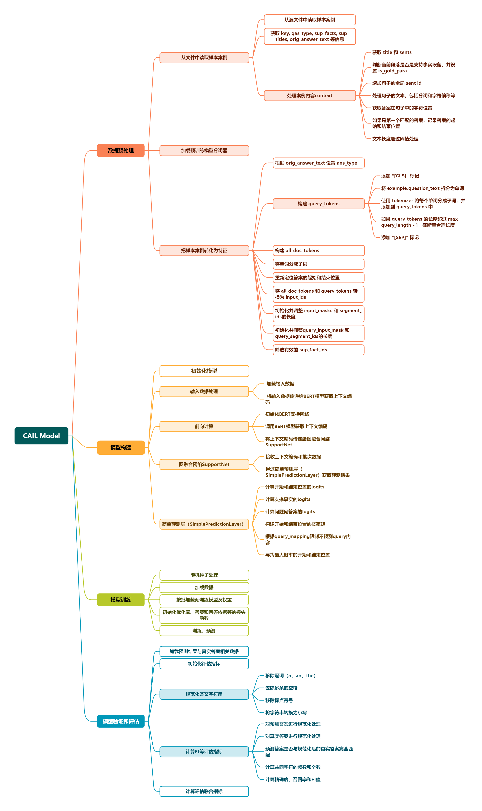

### 一、背景介绍

近年来，随着以裁判文书为代表的司法大数据不断公开，以及自然语言处理技术的不断突破，如何将人工智能技术应用在司法领域，辅助司法工作者提升案件处理的效率和公正性，逐渐成为法律智能研究的热点。中国法律智能技术评测CAIL(Challenge of AI in Law)旨在为研究者提供交叉学科的学术交流平台，推动自然语言处理、智能信息检索等人工智能技术在法律领域的应用，共同促进中国法律智能技术的创新发展，为科技赋能社会治理作出贡献。

为了促进智能技术赋能司法，实现更高水平的数字正义，在最高人民法院和中国中文信息学会的指导下，从2018年起，CAIL已连续举办了四届中国法律智能技术评测，先后吸引了来自海内外高校、企业和组织的近5000支队伍参赛，成为中国法律智能技术评测的重要平台。

本实验以CAIL 2020阅读理解的任务为标本。覆盖多种法律文书类型，包括民事、刑事、行政，问题类型为多步推理，即对于给定问题，只通过单句文本很难得出正确回答，模型需要结合多句话通过推理得出答案。裁判文书中包含了丰富的案件信息，比如时间、地点、人物关系等等，通过机器智能化地阅读理解裁判文书，可以更快速、便捷地辅助法官、律师以及普通大众获取所需信息。

**原基线代码：https://github.com/china-ai-law-challenge/CAIL2020/tree/master/ydlj**

### 二、代码注释

详细注释见代码内文件。

### 三、使用的模型

建议离线下载回本地。

#### chinese-bert-wwm

https://drive.google.com/open?id=1AQitrjbvCWc51SYiLN-cJq4e0WiNN4KY

#### chinese-roberta-wwm-ext

https://drive.google.com/open?id=1eHM3l4fMo6DsQYGmey7UZGiTmQquHw25

#### chinese-roberta-wwm-ext-large

https://drive.google.com/open?id=1-2vEZfIFCdM1-vJ3GD6DlSyKT4eVXMKq

#### 清华大学民事文书BERT

https://thunlp.oss-cn-qingdao.aliyuncs.com/bert/ms.zip

### 四、数据预处理

每一个模型，数据预处理都必须分别做。处理的逻辑和代码在baseline/preprocess.py中

#### 4.1 2020年司法阅读理解数据预处理

详细见：preprocess.ipynb

#### 4.2 加入2019年司法阅读理解

按2020年数据集的格式，格式化2019年阅读理解数据集。这里只使用2019年的训练集。对于2019年数据集的多个问题，优先采用标记为重要、且有答案的问题；如果没有，则再优先取答案内容为“yes”/”no”的问题。

数据预处理时，格式化2019年训练集后，合并到2020年原数据集中。训练过程保持不变即可。

详细代码和过程，见：preprocess_2019.ipynb

### 四、训练

训练的逻辑和代码在baseline/run_cail.py中. GNN还在测中。中间的训练过程和结果因为GitHub上不方便看，已删除。有兴趣的改哈模型的地址即可跑通。

### 五、评估
未调优，初步结果对比：

|      model      | chinese-bert-wwm | chinese-roberta-wwm-ext | thunlp-ms | chinese-roberta-wwm-ext-large | chinese-roberta-wwm-ext-large +2019 训练数据 |
| :-------------: | :--------------: | :---------------------: | :-------: | :---------------------------: | :------------------------------------------: |
|     **em**      |     0.656746     |        0.660714         | 0.507937  |           0.698413            |                   0.722222                   |
|     **f1**      |     0.738114     |        0.742294         | 0.598491  |           0.780310            |                   0.803537                   |
|    **prec**     |     0.756660     |        0.765531         | 0.612723  |           0.798370            |                   0.825009                   |
|   **recall**    |     0.742308     |        0.745274         | 0.602586  |           0.780715            |                   0.803520                   |
|    **sp_em**    |     0.353175     |        0.434524         | 0.240079  |           0.454365            |                   0.484127                   |
|    **sp_f1**    |     0.703424     |        0.748702         | 0.623008  |           0.763559            |                   0.777972                   |
|   **sp_prec**   |     0.750628     |        0.783929         | 0.698635  |           0.802976            |                   0.827579                   |
|  **sp_recall**  |     0.702414     |        0.750430         | 0.617097  |           0.766601            |                   0.766435                   |
|   **join_em**   |     0.269841     |        0.317460         | 0.170635  |           0.359127            |                   0.400794                   |
|   **join_f1**   |     0.562448     |        0.588790         | 0.414918  |           0.628713            |                   0.668635                   |
|  **join_prec**  |     0.605216     |        0.632440         | 0.464531  |           0.671026            |                   0.724943                   |
| **join_recall** |     0.568289     |        0.593397         | 0.414549  |           0.631249            |                   0.660585                   |
