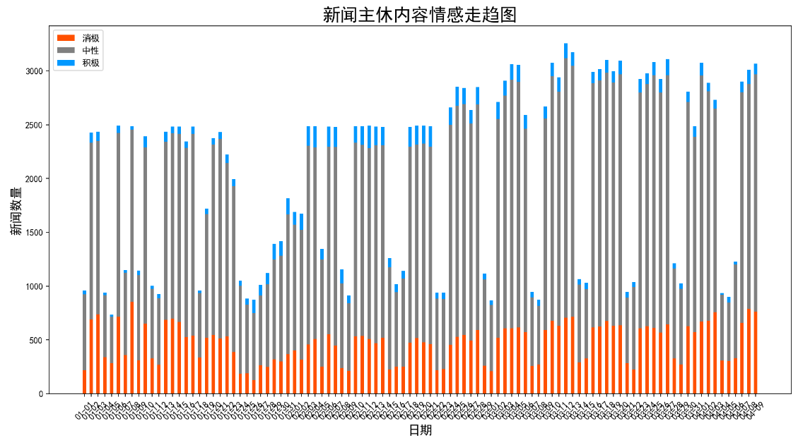
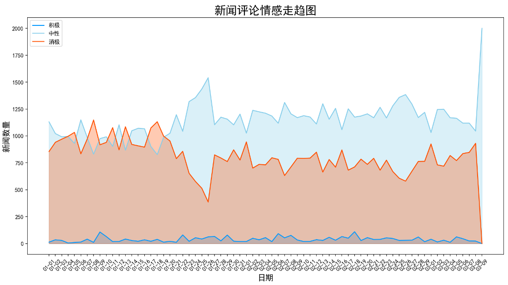

#### 一、引入 CCF_BDCI_2019

#### 二、思绪导图

/web/image/CSDC-News.png)

#### 三、仿清华NLP实验室的关键词动态变化图

(点击可播放)

<video src="./web/mp4/绘制关键词变化动态图.mp4"></video>

#### 四、情感分析示意

### 五、其它

因为时间和算力的原因，数据集都只训练了部分。具体请看代码。

news 文件夹下对应的是CSDC-News，自行官网下载（看里面RAEDME.md）

#### -----------------------------------------------------------------------------------------------------------------------------------

#### 如果有用，请给个星星。又不花钱，对吧？就算没用，也顺手给哈？~_~
